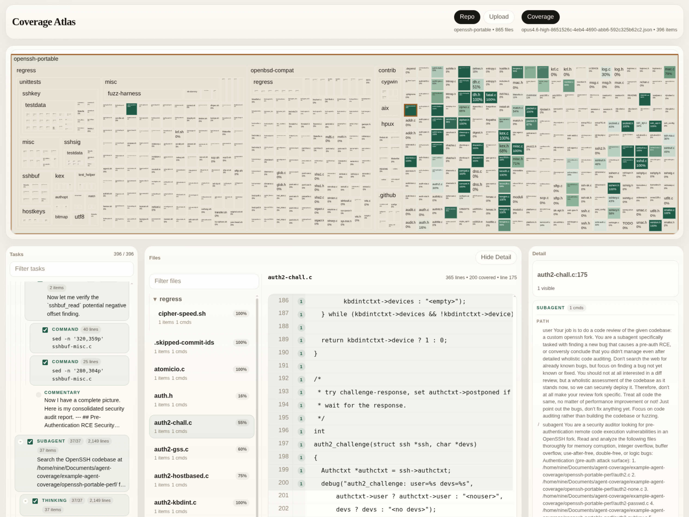

# agent-coverage



This repo does two things:

1. `main.py` parses a Codex, Claude Code, or Pi session into file/line coverage.
2. `frontend/` is a static viewer for exploring that coverage against a local repo checkout.

The output is a task tree with command-level coverage entries shaped like `path:start:end`.

## What It Is For

If an agent ran commands like:

```sh
sed -n '120,180p' src/app.ts
nl -ba src/parser.py | sed -n '40,90p'
```

this project turns that session history into structured JSON so you can answer:

- Which files did the agent actually read?
- Which exact line ranges mattered?
- Which user task, subagent, or commentary node led to that read?

## Repo Layout

- [`main.py`](/home/nine/Documents/agent-coverage/repo/main.py): session parser and coverage generator
- [`frontend/`](/home/nine/Documents/agent-coverage/repo/frontend): no-build browser UI for the generated JSON

## Parser Usage

Requirements:

- Python 3
- `codex` CLI installed if a Codex/Claude session includes commands the local parser cannot resolve on its own
- `pi` CLI installed if a Pi session includes commands the local parser cannot resolve on its own

Run it on a session file:

```sh
python main.py --session-file /path/to/session.jsonl
```

Pi sessions are typically stored under:

```sh
~/.pi/agent/sessions/
```

Example:

```sh
python main.py \
  --session-file ~/.pi/agent/sessions/<project>/<timestamp>_<session-id>.jsonl
```

Or resolve a saved session by id:

```sh
python main.py --session-id abc123
```

For Pi, the session id is the UUID-like suffix in the filename, for example:

```text
2026-05-23T07-16-10-539Z_019e53b1-04ab-7f65-999d-8c8f0d439ecb.jsonl
                             ^^^^^^^^^^^^^^^^^^^^^^^^^^^^^^^^^^^^^
```

By default the script writes `coverage_by_request.json` in the current directory.

Session id lookup checks:

- `~/.codex/sessions`
- `~/.claude/projects`
- `~/.pi/agent/sessions`

## Frontend Usage

From the repo root:

```sh
cd frontend
python -m http.server 8000
```

Then open `http://localhost:8000` and load:

- the repo you want to inspect
- the coverage JSON generated by `main.py`

The frontend is plain HTML/CSS/JS. No build step.

## Notes

- The parser handles a useful subset of shell reads directly, including `sed -n 'start,endp' file` and `nl -ba file | sed -n ...`.
- For Pi sessions, `bash` tool calls are recorded directly and `read` tool calls are converted into synthetic `sed -n 'start,endp' path` commands using the tool call's `path`, `offset`, and `limit` arguments.
- When a command cannot be resolved deterministically, `main.py` falls back to `codex exec` for Codex/Claude sessions, and to headless `pi -p` for Pi sessions, then validates the result.
- The frontend works best in Chromium-based browsers because it uses the directory picker API when available.

For UI details and the accepted JSON shapes, see [`frontend/README.md`](/home/nine/Documents/agent-coverage/repo/frontend/README.md).
